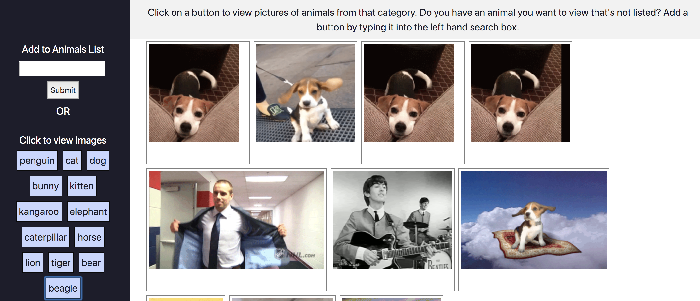

# Giphy-API

## An excerise in using Bootstrap, CSS, an API Key, Javascript, and jQuery.
This layout uses a side navbar that will scroll only when nessassary. 

view the site https://jartschwager.github.io/Giphy-API/

JS breakdown

* On click giphy button will show the data from the Giphy API
* A create Button feature creates a new button based on the input from the text form. This new button will now call the API for those images.
* The buttons are held in an array 
* Pull the images from the API, use an ajax call and loop over to collect the images.

